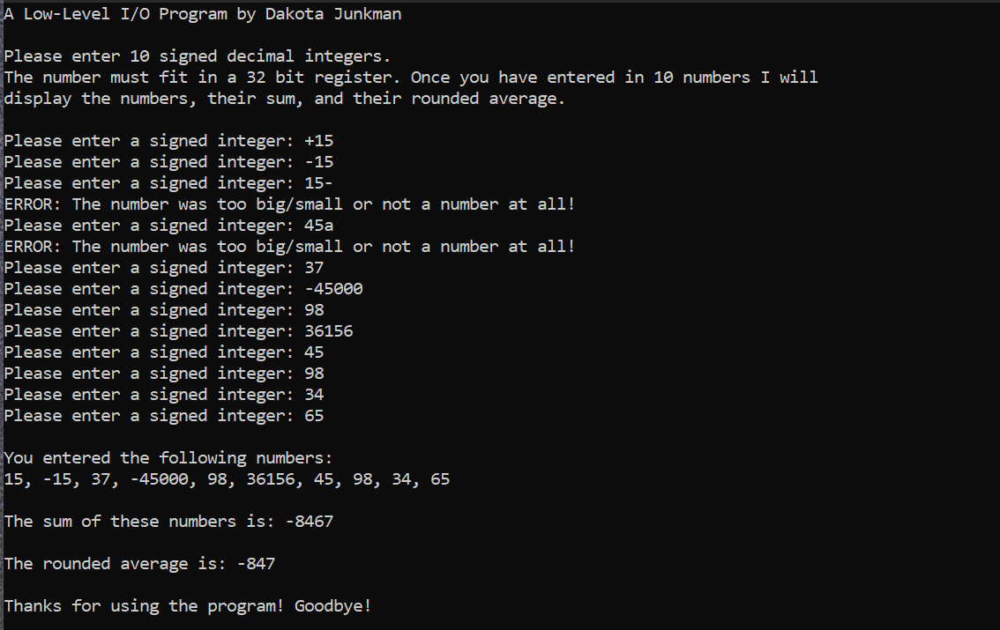

# Low-Level-IO-Program

## Technologies
- x86 MASM Assembly Language

## Overview
This program prompts the user to enter in 10 integers that are able to fit in a 32-bit register. It displays an error message and prompts the user to try again when the input is not a number. The program uses an algorithm to convert the inputted numbers from strings to integers. It then calculates the sum and average of the input. Lastly, another algorithm is used to convert the numbers back to strings so they can be displayed to output.  

